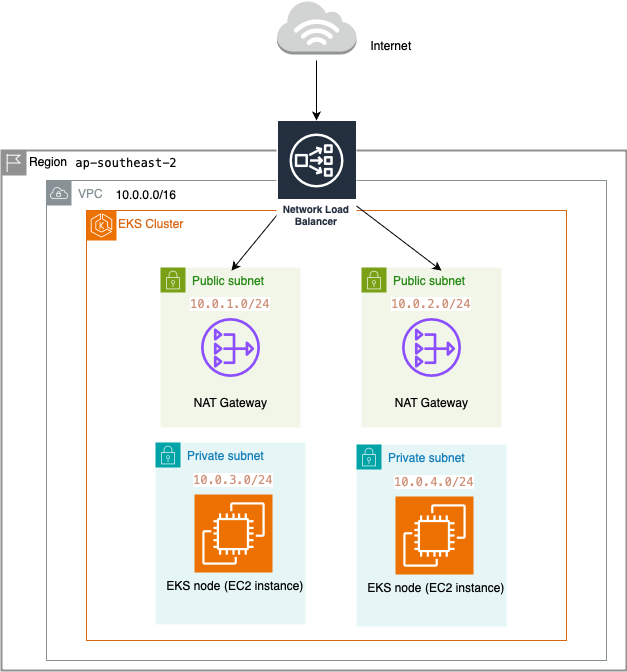

# thefakeapi

A simple CRUD API to create/read/update/delete messages. Scripts to setup the API are available.

## Getting Started
- To run this project, there are 2 ways:
  1. Running locally on your machine
     - Requirements:
       - Docker Desktop (kubernetes enabled)
       - kubectl
     - Using a bash terminal, run the following command to start the kubernetes cluster locally:
       - `sh local-deploy-scripts/test-kubernetes.sh`
     - Using a bash terminal, run the following command to stop the kubernetes cluster locally:
       - `sh local-deploy-scripts/delete-kubernetes.sh`
     - To access the website:
       - http://localhost
  2. Running in cloud (AWS)
     - Requirements:
       - Terraform
       - AWS CLI
       - kubectl 
       - helm
     --- 
     - To setup EKS cluster and ingress controller, 
       - `cd eks-setup`
       - `sh setup-eks.sh` to setup the eks cluster using terraform
       - `sh setup-ingress-controller.sh` to setup the ingress controller
     - To deploy the containers in EKS cluster,
       - `sh eks-deploy-scripts/test-kubernetes.sh`
     - To access the website:
       - `kubectl get ingress` to find the ingress' address
       - `http://<address of the ingress>` 
     --- 
     - To delete the containers in EKS cluster,
       - `sh eks-deploy-scripts/delete-kubernetes.sh`
     - To destroy the EKS cluster and ingress controller, 
       - `cd eks-setup`
       - `sh delete-ingress-controller.sh` to delete the ingress controller
       - `sh delete-eks.sh` to delete the eks cluster using terraform
- Please allow some time (around 3 minutes) for the thefakeapi container to restart so that it will connect to the mongodb container
- For local development,
  - To start the frontend to test the api
    - `cd frontend` 
    - `pip install -r requirements.txt`
    - `fastapi dev main.py`
  - To start thefakeapi
    - `cd backend`
    - `npm i`
    - `npm run start`

## How security mechanisms are implemented.
1. Set HTTP response security headers using helmet.js. 
   - When the backend server sends a response to client, it will attach extra security headers such as "cross-origin-opener-policy" to place restrictions on what the website can do with the response. 
2. Set the container to run as an non-root user and prevent privilege escalation attacks.
   - The container will run as a user that is set during docker build.
   - For example, running as a user with uid 4000 
  ``` 
  - securityContext: 
      runAsUser: 4000
  ```

## Architecure 
I setup a kubernetes cluster using AWS' EKS managed service. The cluster consists of 2 EC2 instances as worker nodes, a NAT gateway, and a network load balancer. 



A CICD pipeline is setup using Github Actions. The pipeline can be found in .github/workflows/main.yml